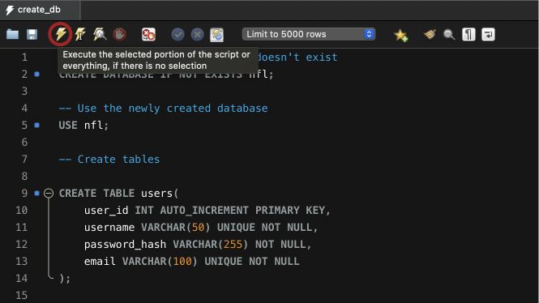

This project is in the process of being hosted on the AWS cloud.

If you would like to run a local instance of the project on your machine in the meantime, follow these instructions:

Clone the repository

```sh
git clone https://github.com/vanbrantley/NFL.git
```

# Database setup

## Create a Python virtual environment

Navigate to the backend folder from the main folder

```sh
cd backend
```

Create a virtual environment named **venv**

```sh
python3 -m venv venv
```

Activate the virtual environment

```sh
source venv/bin/activate
```

Note: When you are finished running the project, deactivate the virtual environment

```sh
deactivate
```

## Install required dependencies

With the virtual environment activated, install the project's dependencies

```sh
pip install -r requirements.txt
```

## Install MySQL

Install MySQL to your machine: https://dev.mysql.com/downloads/mysql/

## Install MySQL Workbench

Install MySQL Workbench to your machine: https://dev.mysql.com/downloads/workbench/

## Launch a SQL Server

### Mac

- Open System Preferences
- Scroll down to the bottom of the left menu and select the MySQL preference panel
- Click Start MySQL Server


### Windows

- Open the Run window by pressing Windows key + R
- Type services.msc
```sh
servives.msc
```
- Locate the MySQL service
- Click Start


## Create a .env file to store your database credentials

Navigate to the backend folder from the main folder

```sh
cd backend
```

Create a file named .env

```sh
touch .env
```

Add the following fields to the .env file, substituting in your username and password in the DB_USERNAME and DB_PASSWORD fields

```yaml
DB_USERNAME=your_username
DB_PASSWORD=your_password
DB_HOST=127.0.0.1
DB_PORT=3306
DB_NAME=nfl
```

## Create the database in MySQL Workench

Open MySQL Workbench

Open the SQL script **backend/scripts/create_db.sql**
- File --> Open SQL Script...
- Shortcut: Shift + Command + O

Execute the SQL script
- Click the lightning icon
- Shortcut: Command + Enter



View tables by refreshing your schemas, and then pressing the database lightning bolt icon


## Populate the database tables

Note: need to have create virtual environment section before this one

Navigate to the backend folder from the main folder

```sh
cd backend
```

Activate the virtual environment if not already activated

```sh
source venv/bin/activate
```

Run the populate_db.py script

```sh
python3 populate_db.py
```

## Deleting the database

If for any reason you would like to delete the database from your MySQL Workbench, run the delete_tables.sql script

Open the SQL script **backend/scripts/delete_tables.sql**
- File --> Open SQL Script...
- Shortcut: Shift + Command + O

Execute the SQL script
- Click the lightning icon
- Shortcut: Command + Enter

# Running the project

Launch the backend and frontend servers separately using two different terminal windows

## Backend

Navigate to the backend folder from the main folder

```sh
cd backend
```

Actviate your virtual environment

Mac: 
```sh
source venv/bin/activate
```

Windows:
```sh
venv\Scripts\activate
```


Launch the backend server

```sh
python3 app.py
```

## Frontend

Open another terminal window

Navigate to the frontend folder from the main folder

```sh
cd frontend
```

Before launching the frontend for the first time, install required packages

```sh
npm install
```

Launch the frontend server
```sh
npm run dev
```

# Closing the project

## Backend

Open the terminal window running the backend server

To stop the backend server, press the **c** key on the keyboard while holding the **control** key

```
control+C
```

## Frontend

Open the terminal window running the frontend server

To stop the frontend server, press the **c** key on the keyboard while holding the **control** key

```
control+C
```


